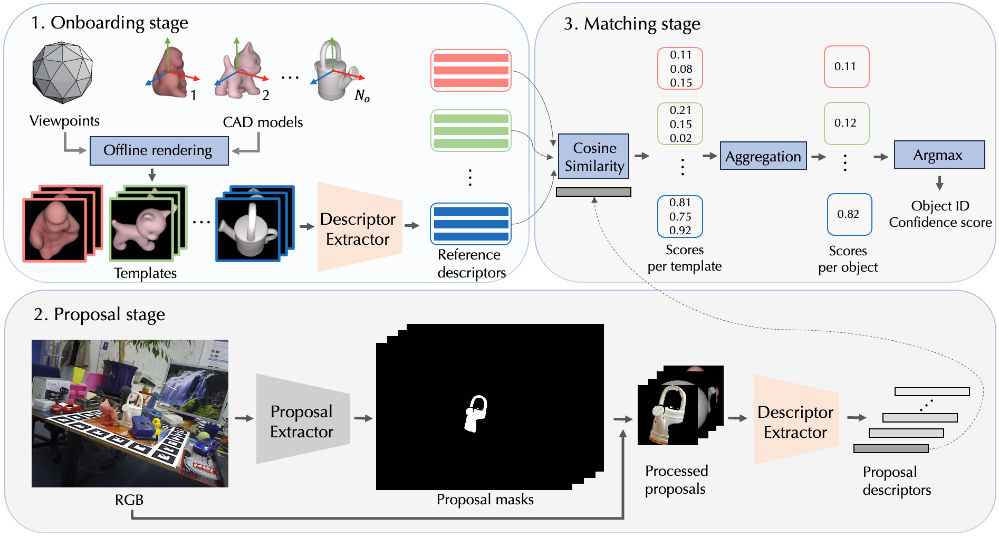
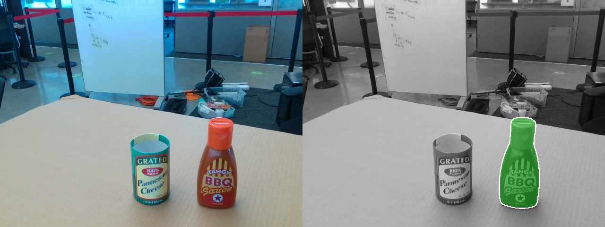

<div align="center">
<h2>
CNOS: A Strong Baseline for CAD-based Novel Object Segmentation
</h2>
</div>

CNOS is a simple three-stage approach for CAD-based novel object segmentation. It is based on [Segmenting Anything](https://github.com/facebookresearch/segment-anything), [DINOv2](https://github.com/facebookresearch/dinov2) and can be used for any objects without retraining. CNOS outperforms the supervised MaskRCNN (in CosyPose) which was trained on target objects. CNOS has been used as the baseline for [Task 5](https://bop.felk.cvut.cz/leaderboards/detection-unseen-bop23/core-datasets/) and [Task 6](https://bop.felk.cvut.cz/leaderboards/segmentation-unseen-bop23/core-datasets/) in [BOP challenge 2023](https://bop.felk.cvut.cz/challenges/bop-challenge-2023/)!



</h3>
</div>

## Requirements
This work has been tested on Ubuntu 22.04, Cuda 12.1, Python 3.10, Nvidia RTX 3060 GPU.

## Installation:

Please make sure that you update this [user's configuration](https://github.com/nv-nguyen/cnos/blob/main/configs/user/default.yaml) before conducting any experiments. 

### Create conda environment
```
git clone https://github.com/ArghyaChatterjee/cnos.git
cd cnos
source ~/miniconda3/bin/activate
conda env create -f environment.yml
conda activate cnos

# for using SAM
pip install git+https://github.com/facebookresearch/segment-anything.git

# for using fastSAM
pip install ultralytics==8.0.135
```

### Datasets and model weights

#### Download datasets from [BOP challenge](https://bop.felk.cvut.cz/datasets/):

For [BOP challenge 2024](https://bop.felk.cvut.cz/challenges/bop-challenge-2024/) core datasets (HOPE, HANDAL, HOT-3D), download each dataset with the following command:
```
pip install -U "huggingface_hub[cli]"
export DATASET_NAME=hope
python -m src.scripts.download_bop_h3 dataset_name=$DATASET_NAME

# For model-free tasks
python -m src.scripts.download_modelfree_onboarding_bop_h3
```


For [BOP challenge 2023](https://bop.felk.cvut.cz/challenges/bop-challenge-2023/) core datasets (LMO, TLESS, TUDL, ICBIN, ITODD, HB, and TLESS), download all datasets with the following command:
```
python -m src.scripts.download_bop_classic
```

#### Rendering templates with [Pyrender](https://github.com/mmatl/pyrender):
Note: This rendering is fast. For example, using a single V100 GPU, it can be done within 10 minutes for seven core datasets of BOP'23. 

For [BOP challenge 2024](https://bop.felk.cvut.cz/challenges/bop-challenge-2024/) core datasets (HOPE, HANDAL, HOT-3D), rendering templates with Pyrender is only required for model-based tasks, while for model-free tasks, you can skip this step since the images in onboarding videos can be used directly. To render templates for model-based tasks:
```
export DATASET_NAME=hope
python -m src.scripts.render_template_with_pyrender dataset_name=$DATASET_NAME
```
For [BOP challenge 2023](https://bop.felk.cvut.cz/challenges/bop-challenge-2023/) core datasets (LMO, TLESS, TUDL, ICBIN, ITODD, HB, and TLESS), you can use the pre-rendered templates at [this Google Drive link (4.64GB)](https://drive.google.com/file/d/1yz2-q74PGws1OtDalX3ySo7AhiwWveK1/view?usp=sharing) and unzip it into $ROOT_DIR or render template from scratch with:
```
python -m src.scripts.render_template_with_pyrender
```

#### Download model weights of [Segmenting Anything](https://github.com/facebookresearch/segment-anything):
```
python -m src.scripts.download_sam
```

#### Download model weights of [Fast Segmenting Anything](https://github.com/CASIA-IVA-Lab/FastSAM):
```
python -m src.scripts.download_fastsam
```

#### Download [BlenderProc4BOP](https://bop.felk.cvut.cz/datasets/) set:
This is only required when you want to use realistic rendering with BlenderProc.


For [BOP challenge 2024](https://bop.felk.cvut.cz/challenges/bop-challenge-2024/) core datasets (HOPE, HANDAL, HOT-3D), this download is only required for model-based tasks:
```
pip install -U "huggingface_hub[cli]"
export DATASET_NAME=hope
python -m src.scripts.download_train_pbr_bop24 dataset_name=$DATASET_NAME
```
For [BOP challenge 2023](https://bop.felk.cvut.cz/challenges/bop-challenge-2023/) core datasets (LMO, TLESS, TUDL, ICBIN, ITODD, HB, and TLESS):
```
python -m src.scripts.download_train_pbr_bop23
```

##  Testing on custom datasets:
You can run CNOS on your custom dataset given a RGB image and the CAD model of the target object. 



Change the file path inside `configs/config.json`. If you want to use Fast-SAM instead of SAM, inside `config.json` file of `config` folder, change `model: cnos` to `model: cnos_fast`. 

Download model weights of [Segmenting Anything](https://github.com/facebookresearch/segment-anything):
```
python -m src.scripts.download_sam
```

Download model weights of [Fast Segmenting Anything](https://github.com/CASIA-IVA-Lab/FastSAM):
```
python -m src.scripts.download_fastsam
```

Render the template from CAD models:
```
bash ./src/scripts/render_custom.sh
```
If the quality of rendering is not good, you can try to ajust the lightning conditions and distance between the camera and the object in [this script](https://github.com/nv-nguyen/cnos/tree/main/src/scripts/render_custom.sh).

Run CNOS and visualize the results:
```
bash ./src/scripts/run_inference_custom.sh
```
The detections will be saved at $OUTPUT_DIR/cnos_results. This script is used by default for single-CAD object segmentation. If you want to segment multiple objects, please make few adaptations [this script](https://github.com/nv-nguyen/cnos/tree/main/src/scripts/inference_custom.py).

##  Testing on [BOP datasets](https://bop.felk.cvut.cz/datasets/):

We provide CNOS's predictions for three core dataset of [BOP challenge 2024](https://bop.felk.cvut.cz/challenges/bop-challenge-2024/) with SAM model and seven core dataset of [BOP challenge 2023](https://bop.felk.cvut.cz/challenges/bop-challenge-2023/) with both SAM and FastSAM models in [this link](https://drive.google.com/drive/folders/1yGRKpz1RI4h5-u0drusVeXPuAsg_GIO5?usp=sharing).


Run CNOS to get predictions:

For [BOP challenge 2024](https://bop.felk.cvut.cz/challenges/bop-challenge-2023/) datasets:
```
export DATASET_NAME=hope
# model-free tasks: with SAM + static onboarding
python run_inference.py dataset_name=$DATASET_NAME model.onboarding_config.rendering_type=onboarding_static

# model-free tasks: with SAM + dynamic onboarding
python run_inference.py dataset_name=$DATASET_NAME model.onboarding_config.rendering_type=onboarding_dynamic

# model-based tasks: with SAM + PBR
python run_inference.py dataset_name=$DATASET_NAME model.onboarding_config.rendering_type=pbr

# model-based tasks: with SAM + pyrender
python run_inference.py dataset_name=$DATASET_NAME model.onboarding_config.rendering_type=pyrender
```

For [HOT3D](https://facebookresearch.github.io/hot3d/) datasets:
```
huggingface-cli download bop-benchmark/datasets --include "hot3d/object_models/*" --local-dir $DATASET_DIR --repo-type=dataset
python -m src.scripts.render_template_with_pyrender dataset_name=hot3d
```

For [BOP challenge 2023](https://bop.felk.cvut.cz/challenges/bop-challenge-2023/) datasets:
```
export DATASET_NAME=lmo 
# adding CUDA_VISIBLE_DEVICES=$GPU_IDS if you want to use a specific GPU

# with FastSAM + PBR
python run_inference.py dataset_name=$DATASET_NAME model=cnos_fast

# with FastSAM + PBR + denser viewpoints
python run_inference.py dataset_name=$DATASET_NAME model=cnos_fast model.onboarding_config.level_templates=1

# with FastSAM + PyRender
python run_inference.py dataset_name=$DATASET_NAME model=cnos_fast model.onboarding_config.rendering_type=pyrender

# with SAM + PyRender
python run_inference.py dataset_name=$DATASET_NAME model.onboarding_config.rendering_type=pyrender

# with SAM + PBR
python run_inference.py dataset_name=$DATASET_NAME
```
After running this script, CNOS will output a prediction file at [this dir](https://github.com/nv-nguyen/cnos/blob/main/configs/run_inference.yaml#L9). You can then evaluate this prediction on [BOP challenge website](https://bop.felk.cvut.cz/).

### Visualize the predictions:

There are two options:

Using our custom visualization without Detectron2 (display only masks)

```
python -m src.scripts.visualize dataset_name=$DATASET_NAME input_file=$INPUT_FILE output_dir=$OUTPUT_DIR
```

Using Detectron2 (display both masks, objectID, scores)
```
python -m pip install 'git+https://github.com/facebookresearch/detectron2.git'
python -m src.scripts.visualize_detectron2 dataset_name=$DATASET_NAME input_file=$INPUT_FILE output_dir=$OUTPUT_DIR
```


Tricks and tips to improve results when running on custom objects with the sample taken from [jakob-ropers-snkeos](https://github.com/jakob-ropers-snkeos).


Please note that SAM or FastSAM can perform exceptionally well, even on very small objects. However, certain parameters from the original implementation require adjustments to achieve optimal results. For example, it is recommended to reduce the default stability_score_thresh value of 0.97 to smaller settings, like 0.5 (applied after step 1 of rendering).
```
python -m src.scripts.inference_custom --template_dir $OUTPUT_DIR --rgb_path $RGB_PATH --stability_score_thresh 0.5
```
</details>
